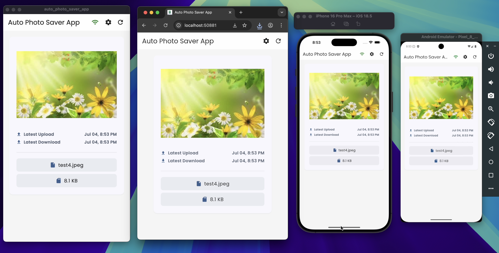
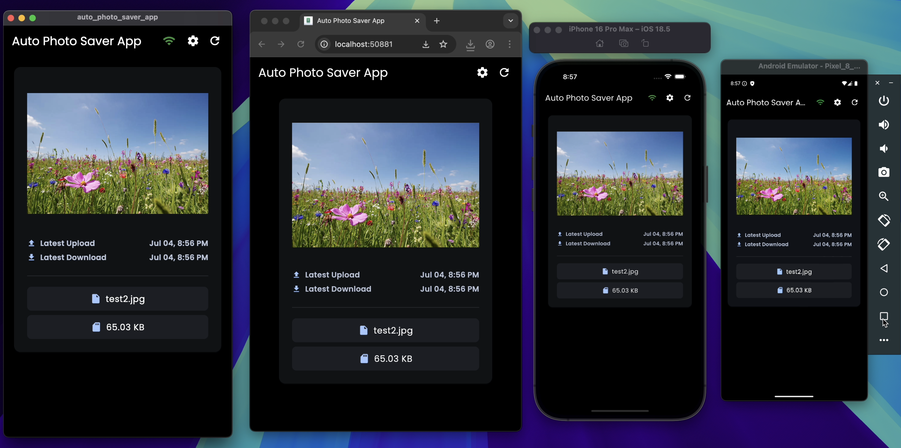

# 📸 Auto Photo Saver App

A cross-platform Flutter application that automatically downloads and saves photos from a Django backend to your device's gallery. The app features **real-time WebSocket updates**, background processing, network monitoring, and a clean, modern UI.

## 🌟 Features

### 📱 Mobile App (Flutter)
- **⚡ Real-time WebSocket Updates**: Instant photo notifications via WebSocket connection
- **🔄 Automatic Photo Download**: Background service downloads new photos every 15 minutes
- **📶 Smart Network Monitoring**: Only connects on WiFi/Ethernet, disconnects on mobile/offline
- **🌍 Multi-language Support**: English, German, and Arabic localization
- **🌙 Dark/Light Theme**: Automatic theme switching with user preference
- **📱 Cross-platform**: Works on Android, iOS, Web, Windows, macOS, and Linux
- **💾 Local Storage**: Saves photos to device gallery or downloads folder
- **🔧 Settings Management**: User-configurable background fetch settings
- **📥 Background Fetch**: Continuously monitors for new images and downloads them automatically
- **🆔 Photo ID Tracking**: Uses unique photo IDs to ensure only new photos are downloaded
- **🔌 WebSocket Status Indicator**: Real-time connection status with visual feedback

### 🖥️ Backend API (Django + WebSocket)
- **📤 Photo Upload**: RESTful API for uploading photos
- **🖼️ Image Management**: Single photo storage with automatic replacement
- **📊 File Information**: Tracks file size, original filename, and upload timestamp
- **🔒 CORS Support**: Configured for cross-origin requests
- **📁 Media Serving**: Direct file access with proper headers
- **🔌 WebSocket Support**: Real-time photo notifications using Django Channels
- **🚀 Production Ready**: Deployed on Railway with ASGI support

## 📸 Screenshots

The app runs seamlessly across all supported platforms with both light and dark themes:

### Light Theme


### Dark Theme  


*Screenshots show the app running on multiple platforms including macOS, Web, iPhone, and Android with a clean, modern interface that adapts to both light and dark themes.*

## 🏗️ Architecture

### Frontend Architecture (Clean Architecture)
```
frontend-flutter/
├── lib/
│   ├── core/                    # Core utilities and services
│   │   ├── constants/          # App constants (API/WebSocket URLs)
│   │   ├── error/             # Error handling
│   │   ├── extensions/        # Dart extensions
│   │   ├── localization/      # Internationalization
│   │   ├── network/           # Network utilities & WebSocket
│   │   ├── router/            # Navigation
│   │   ├── services/          # Background services
│   │   ├── theme/             # UI theming
│   │   ├── utils/             # Utility functions
│   │   └── widgets/           # Reusable widgets
│   ├── di/                    # Dependency injection
│   ├── features/              # Feature modules
│   │   ├── photo/            # Photo management feature
│   │   │   ├── data/         # Data layer (WebSocket service)
│   │   │   ├── domain/       # Business logic
│   │   │   └── presentation/ # UI layer (BLoC/Cubit)
│   │   └── settings/         # Settings feature
│   ├── main.dart             # App entry point
│   └── app.dart              # App configuration
├── assets/                    # Images, fonts, and localization files
├── android/                   # Android-specific files
├── ios/                      # iOS-specific files
├── web/                      # Web-specific files
├── windows/                  # Windows-specific files
├── macos/                    # macOS-specific files
├── linux/                    # Linux-specific files
└── pubspec.yaml              # Dependencies and configuration
```

### Backend Architecture (Django REST + WebSocket)
```
backend-django/
├── backend/                  # Django project settings
│   ├── __init__.py
│   ├── settings.py          # Django settings (Channels config)
│   ├── urls.py              # Main URL configuration
│   ├── wsgi.py              # WSGI configuration
│   ├── asgi.py              # ASGI configuration (WebSocket)
│   └── routing.py           # WebSocket routing
├── photo/                   # Photo management app
│   ├── __init__.py
│   ├── models.py            # Database models
│   ├── views.py             # API views
│   ├── serializers.py       # Data serialization
│   ├── urls.py              # URL routing
│   ├── admin.py             # Admin interface
│   ├── apps.py              # App configuration
│   ├── consumers.py         # WebSocket consumers
│   └── migrations/          # Database migrations
├── media/                   # Uploaded files
├── manage.py                # Django management script
├── requirements.txt         # Python dependencies
├── Procfile                 # Railway deployment config
├── build.sh                 # Build script
├── render.yaml              # Render deployment config
└── db.sqlite3              # SQLite database
```

## 🚀 Getting Started

### Prerequisites
- **Flutter SDK** (3.8.1 or higher)
- **Dart SDK** (3.8.1 or higher)
- **Python** (3.8 or higher)
- **Django** (5.2.3)
- **Django Channels** (4.2.2)
- **Daphne** (4.2.1)
- **Android Studio** / **Xcode** (for mobile development)

### 📱 Frontend Setup (Flutter)

1. **Clone the repository**
   ```bash
   git clone https://github.com/Rabee-Omran/Auto-Photo-Saver-App
   cd Auto-Photo-Saver-App/frontend-flutter
   ```

2. **Install dependencies**
   ```bash
   flutter pub get
   ```

3. **Configure URLs** (in `lib/core/constants/constants.dart`)
   ```dart
   // For local development
   static final String baseUrl = "http://localhost:8000";
   static final String wsUrl = "ws://localhost:8000/ws/photo/";
   
   // For production (Railway)
   static final String baseUrl = "https://auto-photo-saver-production.up.railway.app";
   static final String wsUrl = "wss://auto-photo-saver-production.up.railway.app/ws/photo/";
   ```

4. **Run the app**
   ```bash
   # For development
   flutter run
   
   # For specific platform
   flutter run -d chrome    # Web
   flutter run -d android   # Android
   flutter run -d ios       # iOS
   ```

### 🖥️ Backend Setup (Django)

#### Local Development

1. **Navigate to backend directory**
   ```bash
   cd backend-django
   ```

2. **Create virtual environment**
   ```bash
   python -m venv venv
   source venv/bin/activate  # On Windows: venv\Scripts\activate
   ```

3. **Install dependencies**
   ```bash
   pip install -r requirements.txt
   ```

4. **Run migrations**
   ```bash
   python manage.py migrate
   ```

5. **Start the server with WebSocket support**
   ```bash
   # Using Daphne for WebSocket support
   daphne backend.asgi:application --port 8000 --bind 0.0.0.0
   
   # Or using Django development server (no WebSocket)
   python manage.py runserver
   ```

#### Production Deployment (Railway)

The backend is already deployed on Railway and ready to use:

**Production URLs:**
- **API Base**: `https://auto-photo-saver-production.up.railway.app`
- **WebSocket**: `wss://auto-photo-saver-production.up.railway.app/ws/photo/`
- **API Endpoint**: `https://auto-photo-saver-production.up.railway.app/api/photo/`

## 📖 Usage

### 📱 Using the Mobile App

#### Local Development
1. **Start the backend** (see Backend Setup above)
2. **Update Flutter constants** to use localhost URLs
3. **Launch the app** - Connect to local backend
4. **Test WebSocket** - Upload photos and see real-time updates

#### Production (Railway)
1. **Update Flutter constants** to use Railway URLs
2. **Launch the app** - Automatically connects to production backend
3. **Real-time updates** - Photos appear instantly via WebSocket

#### App Features
- **Network Status**: Visual indicator shows WiFi/Ethernet connection
- **WebSocket Status**: Real-time connection status with icons
- **Auto-download**: Photos download automatically when network is available
- **Manual refresh**: Tap refresh to fetch latest photo
- **Settings**: Configure background fetch and theme preferences

### 🖥️ Using the Backend API

#### Production API (Railway)

**Upload a Photo**
```bash
curl -X POST \
  https://auto-photo-saver-production.up.railway.app/api/photo/ \
  -H 'Content-Type: multipart/form-data' \
  -F 'image=@/path/to/your/photo.jpg'
```

**Get Latest Photo**
```bash
curl -X GET https://auto-photo-saver-production.up.railway.app/api/photo/
```

**WebSocket Connection**
```javascript
// JavaScript example
const ws = new WebSocket('wss://auto-photo-saver-production.up.railway.app/ws/photo/');
ws.onmessage = function(event) {
  const data = JSON.parse(event.data);
  if (data.type === 'photo_update') {
    console.log('New photo:', data.image);
  }
};
```

#### Local API (Development)

**Upload a Photo**
```bash
curl -X POST \
  http://localhost:8000/api/photo/ \
  -H 'Content-Type: multipart/form-data' \
  -F 'image=@/path/to/your/photo.jpg'
```

**Get Latest Photo**
```bash
curl -X GET http://localhost:8000/api/photo/
```

#### API Response Format
```json
{
  "id": 1,
  "image": "photo.jpg",
  "original_file_name": "photo.jpg",
  "file_size": 1024000,
  "uploaded_at": "2024-01-15T10:30:00Z"
}
```

#### WebSocket Message Format
```json
{
  "type": "photo_update",
  "image": {
    "id": 1,
    "image": "photo.jpg",
    "original_file_name": "photo.jpg",
    "file_size": 1024000,
    "uploaded_at": "2024-01-15T10:30:00Z"
  }
}
```

## 🔧 Configuration

### Frontend Configuration

#### WebSocket Settings
- **Connection**: Automatic on WiFi/Ethernet
- **Reconnection**: Automatic retry every 5 seconds
- **Status Monitoring**: Real-time connection status
- **Error Handling**: Graceful fallback to HTTP polling

#### Background Service Settings
- **Fetch Interval**: 15 minutes (configurable)
- **Network Requirements**: WiFi/Ethernet only
- **Battery Optimization**: Disabled for reliable background operation
- **Duplicate Prevention**: Uses photo ID comparison to avoid re-downloading

#### Supported Platforms
- ✅ Android (API 21+)
- ✅ iOS (iOS 10+)
- ✅ Web (Chrome, Firefox, Safari)
- ✅ Windows (Windows 10+)
- ✅ macOS (macOS 10.14+)
- ✅ Linux (Ubuntu 18.04+)

### Backend Configuration

#### Production (Railway)
- **Base URL**: `https://auto-photo-saver-production.up.railway.app`
- **WebSocket URL**: `wss://auto-photo-saver-production.up.railway.app/ws/photo/`
- **API Endpoint**: `/api/photo/`
- **ASGI Server**: Daphne for WebSocket support
- **Static Files**: WhiteNoise for serving static files
- **CORS**: Configured for cross-origin requests

#### Local Development
- **Base URL**: `http://localhost:8000`
- **WebSocket URL**: `ws://localhost:8000/ws/photo/`
- **API Endpoint**: `/api/photo/`
- **Database**: SQLite (development)
- **Media Files**: Local file system

## 🛠️ Development

### Frontend Development

#### Project Structure
- **Clean Architecture**: Separation of concerns with data, domain, and presentation layers
- **BLoC Pattern**: State management using flutter_bloc
- **Dependency Injection**: GetIt for service locator pattern
- **Routing**: GoRouter for navigation
- **WebSocket**: Real-time communication with backend

#### Key Dependencies
- `flutter_bloc`: State management
- `get_it`: Dependency injection
- `dio`: HTTP client
- `go_router`: Navigation
- `workmanager`: Background tasks
- `shared_preferences`: Local storage
- `cached_network_image`: Image caching
- `permission_handler`: Permission handling
- `web_socket_channel`: WebSocket communication
- `rxdart`: Reactive programming

### Backend Development

#### Project Structure
- **Django REST Framework**: API development
- **Django Channels**: WebSocket support
- **ASGI**: Asynchronous server gateway interface
- **Daphne**: ASGI server for WebSocket support

#### Key Dependencies
- `Django`: Web framework
- `djangorestframework`: API framework
- `channels`: WebSocket support
- `daphne`: ASGI server
- `django-cors-headers`: CORS support
- `whitenoise`: Static file serving
- `Pillow`: Image processing

## 🚀 Deployment

### Backend Deployment (Railway)

The backend is deployed on Railway using the Railway CLI:

1. **Install Railway CLI**
   ```bash
   npm install -g @railway/cli
   ```

2. **Login to Railway**
   ```bash
   railway login
   ```

3. **Initialize project**
   ```bash
   cd backend-django
   railway init
   ```

4. **Deploy**
   ```bash
   railway up
   ```

### Frontend Deployment

#### Web Deployment
```bash
cd frontend-flutter
flutter build web
# Deploy the build/web folder to your hosting service
```

#### Mobile App Stores
```bash
# Android
flutter build apk --release
flutter build appbundle --release

# iOS
flutter build ios --release
```

## 🔄 Recent Updates

### WebSocket Integration
- ✅ Added real-time WebSocket support using Django Channels
- ✅ Implemented WebSocket status monitoring in Flutter
- ✅ Added automatic reconnection logic
- ✅ Created WebSocket status indicator in UI

### Production Deployment
- ✅ Deployed backend to Railway with ASGI support
- ✅ Configured Daphne server for WebSocket support
- ✅ Added production-ready settings and environment variables
- ✅ Implemented proper static file serving with WhiteNoise

### Network Management
- ✅ Smart network detection (WiFi/Ethernet only)
- ✅ Automatic WebSocket connection/disconnection based on network
- ✅ Graceful fallback to HTTP polling when WebSocket fails
- ✅ Real-time network status indicators

### Code Architecture
- ✅ Clean separation of WebSocket and HTTP logic
- ✅ Proper error handling and retry mechanisms
- ✅ Dependency injection for WebSocket services
- ✅ State management for connection status

## 🤝 Contributing

1. Fork the repository
2. Create a feature branch
3. Make your changes
4. Test thoroughly (local and production)
5. Submit a pull request

## 📄 License

This project is licensed under the MIT License - see the LICENSE file for details.

## 🆘 Support

For support and questions:
- Create an issue on GitHub
- Check the deployment logs on Railway
- Test WebSocket connection using browser developer tools

---

**Happy coding! 🚀**